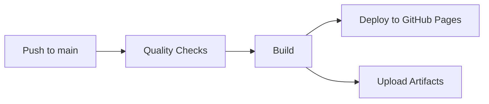

# 🍅 Pomodoro Timer

A beautiful, minimal Pomodoro timer application built with React and TypeScript. Focus on your work with the proven Pomodoro Technique.

## ✨ Features

- **⏱️ Classic Pomodoro Technique**: 25-minute focus sessions with short (5-min) and long (15-min) breaks
- **🔄 Smart Break Management**: Automatic cycle tracking - get a long break after every 4 focus sessions
- **📊 Progress Tracking**: See your daily Pomodoro count and cycle progress at a glance
- **⚙️ Customization**: Adjust timer durations to fit your personal productivity rhythm
- **🔔 Notifications**: Visual banner + optional sound notifications when sessions complete
- **🚀 Auto-Start**: Optional auto-start for breaks and focus sessions to minimize interruptions
- **💾 State Persistence**: Timer state and preferences saved automatically
- **🎨 Beautiful UI**: Warm, calm color scheme with smooth animations and mode-specific colors
- **⌨️ Keyboard Friendly**: Full keyboard navigation support

## 🚀 Quick Start

### Prerequisites

- **Node.js** 18+ and npm

### Installation

```bash
# Clone the repository
git clone https://github.com/yourusername/pomodoro-timer.git
cd pomodoro-timer

# Install dependencies
npm install

# Start development server
npm run dev
```

The app will be available at `http://localhost:5173`

### Build for Production

```bash
# Create production build
npm run build

# Preview production build
npm run preview
```

## 🐳 Docker Deployment

Run the Pomodoro Timer using Docker without installing Node.js on your machine.

### Quick Start with Docker

```bash
# Build the Docker image
docker build -t pomodoro-app .

# Run the container
docker run -d -p 8080:80 --name pomodoro pomodoro-app

# Access the application
open http://localhost:8080
```

### Using Docker Compose

**Development**:
```bash
# Start the application
docker-compose up -d

# View logs
docker-compose logs -f

# Stop the application
docker-compose down
```

**Production**:
```bash
# Build and tag the image
docker build -t pomodoro-app:latest .

# Deploy with production configuration
docker-compose -f docker-compose.prod.yml up -d

# Stop production deployment
docker-compose -f docker-compose.prod.yml down
```

### Docker Commands Reference

```bash
# Build image
docker build -t pomodoro-app:latest .

# Run container (development)
docker run -d \
  -p 8080:80 \
  --name pomodoro \
  --restart unless-stopped \
  pomodoro-app:latest

# View logs
docker logs -f pomodoro

# Check health status
curl http://localhost:8080/health
docker inspect --format='{{.State.Health.Status}}' pomodoro

# Stop and remove container
docker stop pomodoro && docker rm pomodoro
```

### Production Deployment

1. **Build the image**:
   ```bash
   docker build -t pomodoro-app:1.0.0 .
   docker tag pomodoro-app:1.0.0 pomodoro-app:latest
   ```

2. **Deploy with Docker Compose**:
   ```bash
   docker-compose -f docker-compose.prod.yml up -d
   ```

3. **Configure reverse proxy** (nginx/Traefik/Caddy):
   ```nginx
   # Example nginx configuration
   server {
       listen 443 ssl http2;
       server_name pomodoro.example.com;

       ssl_certificate /path/to/cert.pem;
       ssl_certificate_key /path/to/key.pem;

       location / {
           proxy_pass http://localhost:80;
           proxy_set_header Host $host;
           proxy_set_header X-Real-IP $remote_addr;
           proxy_set_header X-Forwarded-For $proxy_add_x_forwarded_for;
           proxy_set_header X-Forwarded-Proto $scheme;
       }
   }
   ```

### Docker Image Details

- **Base Image**: nginx:alpine
- **Production Size**: ~25MB (compressed)
- **Build Time**: 3-4 minutes (first build)
- **Startup Time**: <5 seconds
- **Health Check**: Automatic health monitoring at `/health`

### Docker Requirements

- Docker 20.10+
- Docker Compose 2.0+ (optional, for orchestration)

### Troubleshooting Docker

**Port already in use**:
```bash
# Use a different port
docker run -d -p 3000:80 --name pomodoro pomodoro-app
```

**Container won't start**:
```bash
# Check logs
docker logs pomodoro

# Inspect container
docker inspect pomodoro
```

**Image build fails**:
```bash
# Build with no cache
docker build --no-cache -t pomodoro-app .
```

## 🚀 Deployment

The Pomodoro Timer is automatically deployed to GitHub Pages using GitHub Actions.

### Deployment Status

[](https://github.com/vitaliibekshnev/pomodoro/actions/workflows/deploy.yml)

**Live Application**: https://vitaliibekshnev.github.io/pomodoro/

### Automated Deployment

Every push to the `main` branch automatically:
1. ✅ Runs quality checks (ESLint, TypeScript, tests)
2. ✅ Builds the production application
3. ✅ Deploys to GitHub Pages
4. ✅ Preserves build artifacts for 90 days

### Deployment Workflow



**Typical deployment time**: 1-3 minutes from push to live site

### Pull Request Validation

All pull requests are automatically validated:
- ✅ ESLint code quality checks
- ✅ TypeScript type checking
- ✅ Jest test suite
- ✅ Production build verification

PRs must pass all checks before merging.

### Viewing Workflow Runs

1. Go to the [Actions tab](https://github.com/vitaliibekshnev/pomodoro/actions)
2. Click on a workflow run to see details
3. View logs for each job (quality-checks, build, deploy)
4. Download build artifacts from the workflow run page

### Manual Deployment

If you need to trigger a deployment manually:

```bash
# Commit your changes
git add .
git commit -m "Your commit message"

# Push to main branch
git push origin main

# Monitor deployment at:
# https://github.com/vitaliibekshnev/pomodoro/actions
```

### Build Artifacts

Production build artifacts are preserved for 90 days:
- Available in the workflow run "Artifacts" section
- Contains complete `dist/` folder
- Useful for troubleshooting and rollback

### Deployment Configuration

**GitHub Pages Settings**:
- Source: GitHub Actions
- Branch: Deployed from workflow
- Custom domain: Not configured (using default github.io URL)

**Vite Configuration**:
```typescript
// vite.config.ts
base: '/pomodoro/',  // Required for GitHub Pages subdirectory
```

## 🎯 How to Use

1. **Start a Focus Session**: Click "Start Focus" to begin a 25-minute work session
2. **Take a Break**: When the timer completes, you'll see a notification. Click "Start Break" to begin your break
3. **Track Progress**: Watch your daily Pomodoro count increase. After 4 sessions, you'll get a long break!
4. **Customize**: Click the ⚙️ icon to adjust timer durations, enable auto-start, or toggle sounds
5. **Stay Focused**: The timer continues running even if you navigate away from the tab

## 📁 Project Structure

```
pomodoro/
├── src/
│   ├── components/          # React components
│   │   ├── Timer/          # Timer display and controls
│   │   ├── Settings/       # Settings panel and controls
│   │   ├── Notifications/  # Notification banner
│   │   ├── SessionTracking/# Progress indicators
│   │   └── App.tsx         # Root application
│   ├── hooks/              # Custom React hooks
│   │   ├── useTimer.ts     # Timer logic
│   │   ├── useSettings.ts  # Settings management
│   │   ├── useSessionTracking.ts  # Progress tracking
│   │   ├── useNotifications.ts    # Notification handling
│   │   └── useLocalStorage.ts     # Persistence
│   ├── types/              # TypeScript type definitions
│   ├── utils/              # Utility functions
│   ├── styles/             # Global styles and themes
│   └── constants/          # App constants
├── tests/                  # Test files
│   ├── unit/              # Unit tests
│   └── integration/       # Integration tests
├── public/                # Static assets
│   └── sounds/           # Notification sounds
└── specs/                # Design documentation
```

## 🛠️ Available Scripts

```bash
npm run dev          # Start development server
npm run build        # Build for production
npm run preview      # Preview production build
npm run test         # Run tests
npm run test:watch   # Run tests in watch mode
npm run lint         # Lint code
npm run typecheck    # Type-check TypeScript
```

## ⚙️ Configuration

### Timer Durations

Customize timer durations in the settings panel:

- **Focus**: 5-60 minutes (default: 25)
- **Short Break**: 1-15 minutes (default: 5)
- **Long Break**: 10-30 minutes (default: 15)

### Auto-Start

Enable auto-start to minimize interruptions:

- **Auto-start Breaks**: Automatically start break timer when focus completes
- **Auto-start Focus**: Automatically start focus timer when break completes

### Notifications

- **Sound Notifications**: Toggle sound on/off (visual banner always shows)
- **Sound Preview**: Test notification sounds in settings

## 🧪 Testing

The project includes comprehensive tests for critical functionality:

```bash
# Run all tests
npm test

# Run tests in watch mode
npm run test:watch

# Run tests with coverage
npm run test:coverage
```

## 🎨 Design Philosophy

This Pomodoro timer is designed to be:

- **Minimal**: Clean, distraction-free interface
- **Friendly**: Warm colors, smooth animations, clear feedback
- **Reliable**: State persistence, accurate timing, no data loss
- **Accessible**: Keyboard navigation, clear labels, responsive design
- **Fast**: <150KB bundle, instant interactions, smooth performance

## 📊 Technical Details

- **Framework**: React 18 with TypeScript
- **Build Tool**: Vite
- **Testing**: Jest + React Testing Library
- **State Management**: React Hooks + localStorage
- **Styling**: CSS Modules with CSS variables
- **Bundle Size**: ~50KB gzipped (production)
- **Browser Support**: Chrome 90+, Firefox 88+, Safari 14+, Edge 90+

## 🤝 Contributing

Contributions are welcome! Please follow these guidelines:

1. Fork the repository
2. Create a feature branch (`git checkout -b feature/amazing-feature`)
3. Make your changes
4. Run tests (`npm test`)
5. Commit your changes (`git commit -m 'Add amazing feature'`)
6. Push to the branch (`git push origin feature/amazing-feature`)
7. Open a Pull Request

## 📝 License

This project is licensed under the MIT License - see the LICENSE file for details.

## 🙏 Acknowledgments

- Inspired by the [Pomodoro Technique](https://francescocirillo.com/pages/pomodoro-technique) by Francesco Cirillo
- Built with modern web technologies and best practices

## 📮 Contact

Have questions or suggestions? Open an issue or reach out!

---

**Made with ❤️ and 🍅**

