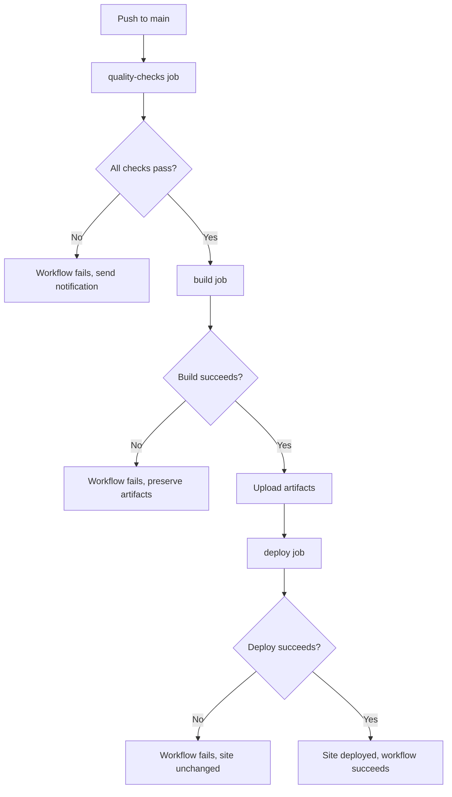
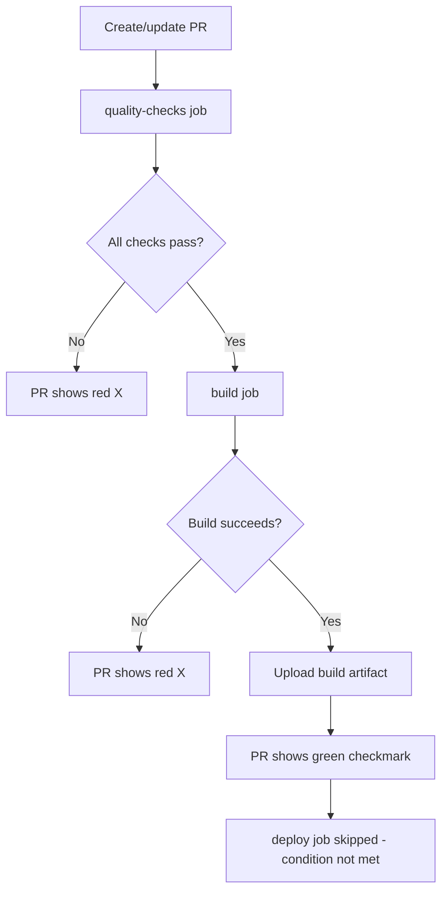
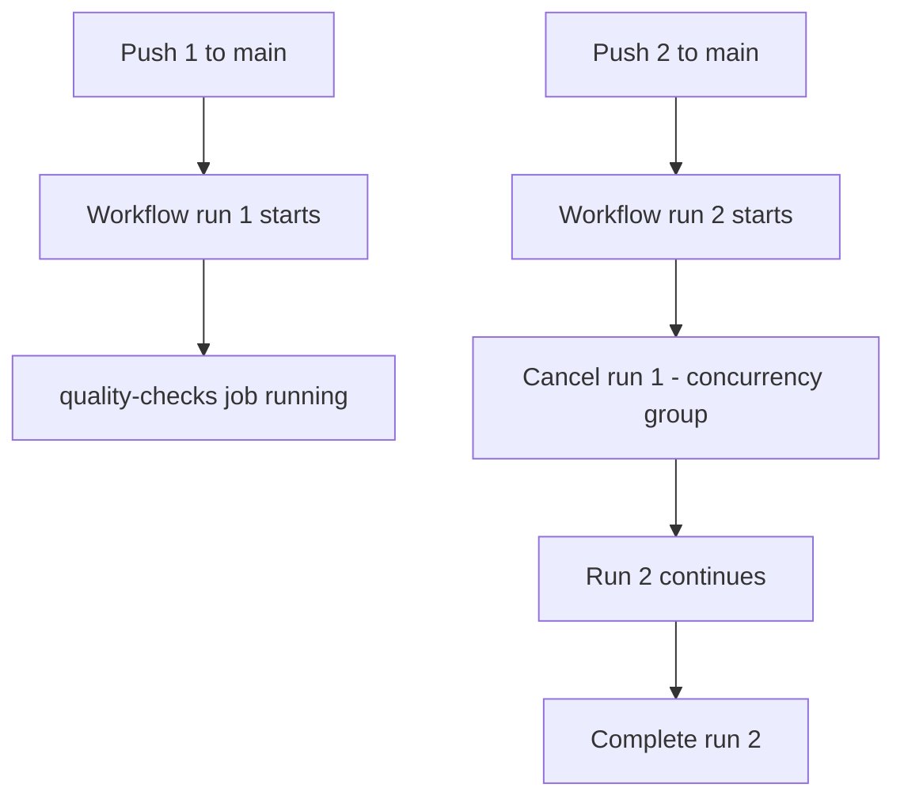

# Data Model: GitHub Actions Workflow Structure

**Feature**: `005-github-actions-deploy`  
**Date**: December 19, 2025  
**Purpose**: Define the structure of the GitHub Actions workflow, jobs, and steps

---

## Overview

This document describes the logical structure of the GitHub Actions CI/CD workflow. Unlike typical data models (database entities), this represents the workflow configuration structure.

---

## Workflow Definition

### Workflow Metadata

```yaml
name: Deploy to GitHub Pages
```

**Properties**:
- **name**: Human-readable workflow identifier
- **Purpose**: Displayed in GitHub Actions UI, commit status checks

---

### Workflow Triggers

```yaml
on:
  push:
    branches: [main]
  pull_request:
    branches: [main]
```

**Properties**:
- **Event type**: `push` or `pull_request`
- **Branch filter**: `main` only
- **Behavior**:
  - Push to main → full workflow (quality + build + deploy)
  - Pull request → quality + build only (skip deploy)
  - Feature branch push → no workflow execution

---

### Workflow Permissions

```yaml
permissions:
  contents: read
  pages: write
  id-token: write
```

**Properties**:
| Permission | Access Level | Purpose |
|------------|--------------|---------|
| `contents` | `read` | Checkout repository code |
| `pages` | `write` | Deploy to GitHub Pages |
| `id-token` | `write` | Generate OIDC token for Pages |

**Scope**: Repository-level, workflow-level (applies to all jobs)

---

### Concurrency Control

```yaml
concurrency:
  group: ${{ github.workflow }}-${{ github.ref }}
  cancel-in-progress: true
```

**Properties**:
- **group**: Unique identifier for concurrent runs (workflow + branch)
- **cancel-in-progress**: `true` (cancel outdated runs)
- **Purpose**: Prevent simultaneous deployments, save minutes

**Behavior**:
- New push to main → cancels previous deployment (if still running)
- New commit to PR → cancels previous PR run

---

## Job Definitions

### Job 1: Quality Checks

```yaml
quality-checks:
  runs-on: ubuntu-latest
```

**Purpose**: Validate code quality (linting, type checking, tests)

**Properties**:
- **runs-on**: `ubuntu-latest` (Linux runner, fastest)
- **Dependencies**: None (first job in workflow)
- **Execution**: Always runs (push or PR)

**Steps**:

#### Step 1.1: Checkout Code
```yaml
- name: Checkout code
  uses: actions/checkout@v4
```
- **Action**: `actions/checkout@v4`
- **Purpose**: Clone repository code
- **Inputs**: None (defaults to current ref)

#### Step 1.2: Setup Node.js
```yaml
- name: Setup Node.js
  uses: actions/setup-node@v4
  with:
    node-version: '18'
    cache: 'npm'
```
- **Action**: `actions/setup-node@v4`
- **Inputs**:
  - `node-version`: `'18'` (LTS)
  - `cache`: `'npm'` (enable dependency caching)
- **Purpose**: Install Node.js, restore npm cache

#### Step 1.3: Install Dependencies
```yaml
- name: Install dependencies
  run: npm ci
```
- **Command**: `npm ci` (clean install)
- **Purpose**: Install packages from package-lock.json
- **Behavior**: Uses cached packages if available

#### Step 1.4: Run ESLint
```yaml
- name: Run ESLint
  run: npm run lint
```
- **Script**: `npm run lint` (defined in package.json)
- **Purpose**: Check code style and quality
- **Failure**: Job fails, workflow stops

#### Step 1.5: Run TypeScript Check
```yaml
- name: Run TypeScript check
  run: npm run typecheck
```
- **Script**: `npm run typecheck` → `tsc --noEmit`
- **Purpose**: Validate TypeScript types
- **Failure**: Job fails, workflow stops

#### Step 1.6: Run Tests
```yaml
- name: Run tests
  run: npm run test:once
```
- **Script**: `npm run test:once` (Jest without watch)
- **Purpose**: Execute unit and integration tests
- **Failure**: Job fails, workflow stops

**Success Criteria**: All steps complete with exit code 0

---

### Job 2: Build

```yaml
build:
  needs: quality-checks
  runs-on: ubuntu-latest
```

**Purpose**: Build production-optimized application

**Properties**:
- **runs-on**: `ubuntu-latest`
- **needs**: `quality-checks` (waits for quality checks to pass)
- **Execution**: Runs if quality checks pass

**Steps**:

#### Step 2.1: Checkout Code
```yaml
- name: Checkout code
  uses: actions/checkout@v4
```
(Same as Step 1.1)

#### Step 2.2: Setup Node.js
```yaml
- name: Setup Node.js
  uses: actions/setup-node@v4
  with:
    node-version: '18'
    cache: 'npm'
```
(Same as Step 1.2)

#### Step 2.3: Install Dependencies
```yaml
- name: Install dependencies
  run: npm ci
```
(Same as Step 1.3)

#### Step 2.4: Build Application
```yaml
- name: Build application
  run: npm run build
```
- **Script**: `npm run build` → `tsc && vite build`
- **Output**: `dist/` directory with static files
- **Purpose**: Generate production build

#### Step 2.5: Upload Build Artifacts
```yaml
- name: Upload build artifacts
  uses: actions/upload-artifact@v4
  with:
    name: production-build
    path: dist/
    retention-days: 90
```
- **Action**: `actions/upload-artifact@v4`
- **Inputs**:
  - `name`: `production-build`
  - `path`: `dist/` (build output)
  - `retention-days`: `90` (3 months)
- **Purpose**: Preserve build for troubleshooting

#### Step 2.6: Upload Pages Artifact
```yaml
- name: Upload Pages artifact
  uses: actions/upload-pages-artifact@v3
  with:
    path: dist/
```
- **Action**: `actions/upload-pages-artifact@v3`
- **Inputs**:
  - `path`: `dist/` (files to deploy)
- **Purpose**: Prepare artifact for GitHub Pages deployment

**Success Criteria**: Build completes, artifacts uploaded

---

### Job 3: Deploy

```yaml
deploy:
  needs: build
  runs-on: ubuntu-latest
  if: github.ref == 'refs/heads/main'
  environment:
    name: github-pages
    url: ${{ steps.deployment.outputs.page_url }}
```

**Purpose**: Deploy to GitHub Pages

**Properties**:
- **runs-on**: `ubuntu-latest`
- **needs**: `build` (waits for build to complete)
- **if**: `github.ref == 'refs/heads/main'` (only on main branch)
- **environment**: 
  - `name`: `github-pages`
  - `url`: Deployment URL (from deploy step output)
- **Execution**: Only on push to main (not on PRs)

**Steps**:

#### Step 3.1: Deploy to GitHub Pages
```yaml
- name: Deploy to GitHub Pages
  id: deployment
  uses: actions/deploy-pages@v4
```
- **Action**: `actions/deploy-pages@v4`
- **id**: `deployment` (for output reference)
- **Inputs**: None (uses uploaded Pages artifact)
- **Outputs**:
  - `page_url`: Deployed site URL
- **Purpose**: Deploy to GitHub Pages

**Success Criteria**: Deployment completes, site accessible

---

## Environment Variables

### GitHub Context Variables

Used in workflow:
- `${{ github.workflow }}`: Workflow name
- `${{ github.ref }}`: Git reference (branch)
- `${{ github.event.repository.name }}`: Repository name
- `${{ secrets.GITHUB_TOKEN }}`: Auto-generated auth token

### Custom Environment Variables

None required for this feature.

---

## Caching Strategy

### npm Dependency Cache

**Cache Key**: Hash of `package-lock.json`

**Cache Location**: `~/.npm` (npm cache directory)

**Behavior**:
| Scenario | Cache | Install Time |
|----------|-------|--------------|
| First run | MISS | ~60-90s |
| Subsequent run (no changes) | HIT | ~10-15s |
| Dependency updated | MISS | ~60-90s |

**Invalidation**: Automatic on `package-lock.json` change

**Implementation**: Built into `actions/setup-node@v4` with `cache: 'npm'`

---

## Artifact Handling

### Production Build Artifact

**Type**: `actions/upload-artifact@v4`

**Properties**:
- **Name**: `production-build`
- **Contents**: Entire `dist/` directory
- **Size**: ~1-5 MB (typical React SPA)
- **Retention**: 90 days
- **Access**: Download from GitHub Actions UI

**Structure**:
```
production-build.zip
├── index.html
├── assets/
│   ├── index-[hash].js
│   ├── index-[hash].css
│   ├── [image files]
│   └── ...
└── [other static files]
```

### GitHub Pages Artifact

**Type**: `actions/upload-pages-artifact@v3`

**Properties**:
- **Name**: `github-pages` (default)
- **Contents**: `dist/` directory
- **Purpose**: Intermediate artifact for deployment
- **Retention**: Temporary (deleted after deployment)
- **Access**: Not directly downloadable (internal)

**Difference from Build Artifact**:
- Build artifact: Long-term storage, troubleshooting
- Pages artifact: Short-term, deployment pipeline only

---

## Workflow Execution Flows

### Flow 1: Push to Main Branch



**Timeline** (typical):
1. Quality checks: ~30-60s
2. Build: ~20-40s
3. Deploy: ~10-20s
4. **Total**: ~60-120s (1-2 minutes)

### Flow 2: Pull Request



**Timeline** (typical):
1. Quality checks: ~30-60s
2. Build: ~20-40s
3. **Total**: ~50-100s (skip deploy)

### Flow 3: Concurrent Runs



**Behavior**: Newest run wins, older runs cancelled

---

## Configuration Dependencies

### Repository Settings

**Required configurations**:
1. **GitHub Pages**:
   - Source: GitHub Actions (not branch-based)
   - Enable Pages in repository settings
2. **Branch Protection** (optional but recommended):
   - Require PR reviews before merge
   - Require status checks (quality-checks, build)
3. **Workflow Permissions**:
   - Read and write permissions for GITHUB_TOKEN
   - Or explicit permissions in workflow (preferred)

### Vite Configuration

**Required change** in `vite.config.ts`:

```typescript
export default defineConfig({
  base: '/pomodoro/',  // Must match repository name
  plugins: [react()],
});
```

**Reason**: GitHub Pages serves from `/<repo>/` subdirectory

**Impact**: Asset paths in built HTML reference `/pomodoro/assets/*`

---

## Performance Metrics

### Build Time Targets

| Metric | Target | Actual (estimated) |
|--------|--------|-------------------|
| Quality checks | <60s | ~40-50s |
| Build | <40s | ~25-35s |
| Deploy | <30s | ~15-25s |
| **Total (main)** | **<3 min** | **~80-110s** |
| **Total (PR)** | **<2 min** | **~65-85s** |

### Caching Impact

| Scenario | Without Cache | With Cache | Speedup |
|----------|--------------|------------|---------|
| npm ci | ~60s | ~10s | 6x faster |
| Overall build | ~120s | ~80s | 33% faster |

### Quota Usage

**GitHub Actions free tier**: 2000 minutes/month

**Estimated usage**:
- Per workflow run: ~1.5 minutes (main), ~1 minute (PR)
- 20 pushes/month: ~30 minutes
- 50 PRs/month: ~50 minutes
- **Total**: ~80 minutes/month (4% of quota)

---

## Error States and Handling

### Quality Check Failures

**Trigger**: ESLint errors, TypeScript errors, failing tests

**Behavior**:
1. Job fails immediately on first error
2. Workflow stops (build and deploy skipped)
3. PR shows red X with error logs
4. Email notification sent

**Recovery**: Fix errors, push new commit, workflow re-runs

### Build Failures

**Trigger**: Vite build errors, out of memory, disk space

**Behavior**:
1. Build job fails
2. Partial build artifacts NOT uploaded
3. Deploy skipped
4. Email notification sent

**Recovery**: Fix build errors, push new commit

### Deploy Failures

**Trigger**: Pages API errors, network issues, quota exceeded

**Behavior**:
1. Deploy job fails
2. Build artifacts preserved (troubleshooting)
3. Previous deployment remains live (no downtime)
4. Email notification sent

**Recovery**: 
- Retry workflow manually
- Check GitHub Pages settings
- Verify quota not exceeded

---

## Status**: Phase 1 data model complete, ready for contracts

