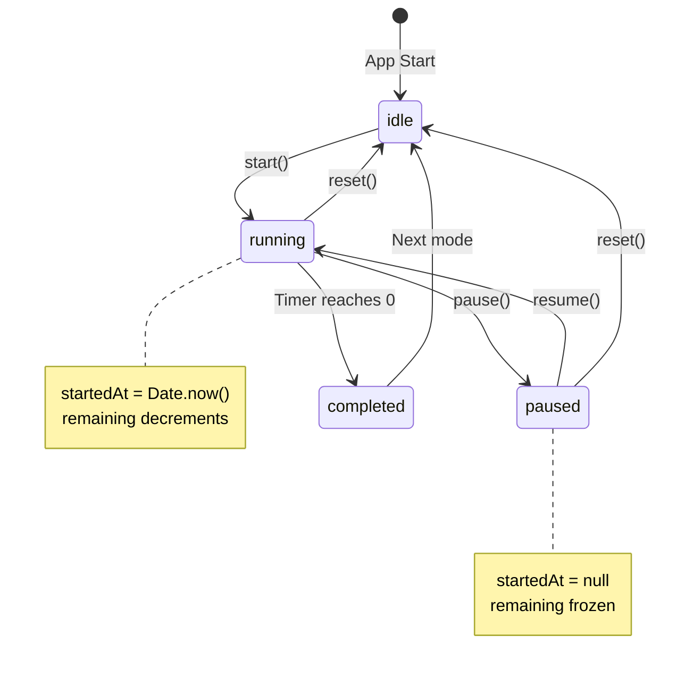

# Data Model: Timer State Persistence

**Feature**: `006-persist-timer-state`  
**Date**: December 19, 2025  
**Purpose**: Define the timer state structure for persistence and restoration

---

## TimerSession Entity

The core data structure representing the complete timer state.

### Structure

```typescript
interface TimerSession {
  /** Current timer mode */
  mode: TimerMode;
  
  /** Total session duration in milliseconds */
  duration: number;
  
  /** Remaining time in milliseconds */
  remaining: number;
  
  /** Current status of the timer */
  status: TimerStatus;
  
  /** Timestamp when timer was last started (for drift compensation and restore) */
  startedAt: number | null;
}
```

### Field Definitions

| Field | Type | Nullable | Description | Validation |
|-------|------|----------|-------------|------------|
| `mode` | `TimerMode` | No | Current timer mode | Must be 'focus', 'short-break', or 'long-break' |
| `duration` | `number` | No | Total session length (ms) | Must be > 0, typically 300000-3600000 (5-60 min) |
| `remaining` | `number` | No | Time left in session (ms) | Must be >= 0 and <= duration |
| `status` | `TimerStatus` | No | Current lifecycle state | Must be 'idle', 'running', 'paused', or 'completed' |
| `startedAt` | `number | null` | Yes | Unix timestamp (ms) when started | null when not running, Date.now() when running |

### Type Definitions

```typescript
type TimerMode = 'focus' | 'short-break' | 'long-break';

type TimerStatus = 'idle' | 'running' | 'paused' | 'completed';
```

---

## State Transitions

### Valid State Transitions



### State Properties

| Status | startedAt | remaining | Interval Running | User Actions |
|--------|-----------|-----------|------------------|--------------|
| `idle` | null | = duration | No | Start |
| `running` | timestamp | decrementing | Yes | Pause, Reset, Skip |
| `paused` | null | frozen | No | Resume, Reset |
| `completed` | null | 0 | No | (auto-transitions to idle) |

---

## Persistence Schema

### localStorage Format

**Key**: `pomodoro_timer_state`

**Value** (JSON):
```json
{
  "mode": "focus",
  "duration": 1500000,
  "remaining": 900000,
  "status": "running",
  "startedAt": 1734615432000
}
```

### Example States

**Running Focus Timer** (10 minutes elapsed, 15 remaining):
```json
{
  "mode": "focus",
  "duration": 1500000,
  "remaining": 900000,
  "status": "running",
  "startedAt": 1734615432000
}
```

**Paused Short Break** (2 minutes elapsed, 3 remaining):
```json
{
  "mode": "short-break",
  "duration": 300000,
  "remaining": 180000,
  "status": "paused",
  "startedAt": null
}
```

**Idle Long Break** (not started):
```json
{
  "mode": "long-break",
  "duration": 900000,
  "remaining": 900000,
  "status": "idle",
  "startedAt": null
}
```

---

## Restore Calculations

### Running Timer Restore

```typescript
// Saved state
const saved = {
  mode: 'focus',
  duration: 1500000,    // 25 minutes
  remaining: 1200000,   // 20 minutes when saved
  status: 'running',
  startedAt: 1734615432000
};

// On restore (5 minutes later)
const now = 1734615732000; // 5 minutes = 300000ms later
const elapsed = now - saved.startedAt; // 300000ms
const currentRemaining = saved.remaining - elapsed; // 1200000 - 300000 = 900000ms (15 min)

if (currentRemaining > 0) {
  // Continue running from 15 minutes
  restoreRunning(currentRemaining);
} else {
  // Timer completed while page was closed
  handleCompletion();
}
```

### Paused Timer Restore

```typescript
// Saved state
const saved = {
  mode: 'focus',
  duration: 1500000,
  remaining: 900000,    // 15 minutes when paused
  status: 'paused',
  startedAt: null
};

// On restore (any time later)
// Use EXACT saved remaining - no calculation
const currentRemaining = saved.remaining; // 900000ms (15 min)

restorePaused(currentRemaining);
```

---

## Default Values

```typescript
const DEFAULT_TIMER_SESSION: TimerSession = {
  mode: 'focus',
  duration: 1500000,  // 25 minutes
  remaining: 1500000,
  status: 'idle',
  startedAt: null,
};
```

Used when:
- No saved state exists (first app visit)
- localStorage unavailable (private mode)
- Corrupted state data (JSON parse error)

---

## Validation Rules

### On Save

No validation required - state is always valid when saving from hook.

### On Restore

```typescript
function validateRestoredState(state: any): TimerSession {
  // Validate structure
  if (!state || typeof state !== 'object') {
    return DEFAULT_TIMER_SESSION;
  }
  
  // Validate mode
  if (!['focus', 'short-break', 'long-break'].includes(state.mode)) {
    state.mode = 'focus';
  }
  
  // Validate status
  if (!['idle', 'running', 'paused', 'completed'].includes(state.status)) {
    state.status = 'idle';
  }
  
  // Validate numeric fields
  state.duration = Math.max(0, Number(state.duration) || 1500000);
  state.remaining = Math.max(0, Math.min(Number(state.remaining) || state.duration, state.duration));
  
  // Validate startedAt
  if (state.status === 'running' && typeof state.startedAt !== 'number') {
    state.status = 'paused'; // Fallback to paused if missing timestamp
    state.startedAt = null;
  }
  
  return state as TimerSession;
}
```

---

## Storage Size

**Typical Size**: 150-200 bytes per save

**Breakdown**:
- mode: ~15 bytes
- duration: ~10 bytes
- remaining: ~10 bytes
- status: ~10 bytes
- startedAt: ~15 bytes
- JSON overhead: ~100 bytes

**localStorage Quota**: 5-10MB (browser dependent)

**Impact**: Negligible (<0.01% of quota)

---

**Status**: Data model complete, ready for implementation

