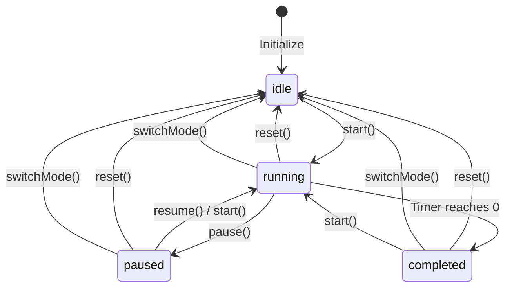

# Data Model: Fix Skip Break Button Behavior

**Feature**: 008-fix-skip-break  
**Created**: December 21, 2025  
**Purpose**: Define state machines, transitions, and data structures for Skip Break functionality

## Overview

This feature modifies button visibility logic in the UI layer. The underlying data model (timer state, session tracking) remains unchanged. This document describes the existing state machines and how Skip Break interacts with them.

## Entity: Timer State

### Definition

The Timer State represents the current state of the Pomodoro timer, including mode, status, remaining time, and session tracking information.

### Fields

| Field | Type | Description | Validation |
|-------|------|-------------|------------|
| `mode` | `TimerMode` | Current timer mode | One of: `'focus'`, `'short-break'`, `'long-break'` |
| `status` | `TimerStatus` | Current timer status | One of: `'idle'`, `'running'`, `'paused'`, `'completed'` |
| `duration` | `number` | Total duration in milliseconds | > 0, based on mode and user preferences |
| `remaining` | `number` | Remaining time in milliseconds | >= 0, <= duration |
| `startedAt` | `number | null` | Timestamp when timer started | Unix timestamp or null |
| `sessionId` | `string` | Unique session identifier | Format: `{timestamp}-{mode}` or `{timestamp}-{mode}-migrated` |

### State Machine: Timer Status



### State Machine: Timer Mode

```mermaid
stateDiagram-v2
    [*] --> focus: Initialize
    focus --> short-break: Complete focus (cycle < 4)
    focus --> long-break: Complete focus (cycle = 4)
    short-break --> focus: Skip break / Complete break
    long-break --> focus: Skip break / Complete break
    focus --> focus: Skip focus
```

### Transitions Relevant to Skip Break

#### Transition 1: Skip Break from Running State

**Trigger**: User clicks "Skip Break" button while break timer is running

**Pre-conditions**:
- `mode` is `'short-break'` or `'long-break'`
- `status` is `'running'`
- `remaining` > 0

**Actions**:
1. Stop countdown interval
2. Call `switchMode('focus')`:
   - Set `mode` = `'focus'`
   - Set `duration` = focus duration from preferences (default 25 min)
   - Set `remaining` = `duration`
   - Set `status` = `'idle'`
   - Generate new `sessionId`
3. Call `start()`:
   - Set `status` = `'running'`
   - Set `startedAt` = `Date.now()`
   - Start countdown interval

**Post-conditions**:
- `mode` = `'focus'`
- `status` = `'running'`
- `duration` = 25 minutes (in milliseconds)
- `remaining` = 25 minutes (in milliseconds)
- `startedAt` = current timestamp
- Timer is actively counting down

**Persistence**: All fields persisted to `localStorage` under key `'pomodoro-timer-state'`

#### Transition 2: Skip Break from Paused State

**Trigger**: User clicks "Skip Break" button while break timer is paused

**Pre-conditions**:
- `mode` is `'short-break'` or `'long-break'`
- `status` is `'paused'`
- `remaining` > 0

**Actions**: Same as Transition 1

**Post-conditions**: Same as Transition 1

#### Transition 3: Skip Break from Completed State

**Trigger**: User clicks "Skip Break" button after break timer completes

**Pre-conditions**:
- `mode` is `'short-break'` or `'long-break'`
- `status` is `'completed'`
- `remaining` = 0

**Actions**: Same as Transition 1

**Post-conditions**: Same as Transition 1

#### Transition 4: Skip Break from Idle State (Edge Case)

**Trigger**: User clicks "Skip Break" button before starting break timer

**Pre-conditions**:
- `mode` is `'short-break'` or `'long-break'`
- `status` is `'idle'`
- `remaining` = full break duration

**Design Decision**: Button should NOT be visible in this state (see research.md).

**Rationale**: If break hasn't started yet, user should use "Start Break" button or the persistent UI "Skip Break - Start Focus" button, not the TimerControls skip button.

## Entity: Session Tracking State

### Definition

Session Tracking State represents the user's daily Pomodoro progress, including completed count and cycle position within the 4-session cycle.

### Fields

| Field | Type | Description | Validation |
|-------|------|-------------|------------|
| `completedCount` | `number` | Total Pomodoros completed today | >= 0 |
| `cyclePosition` | `number` | Current position in 4-session cycle | 0-3 (wraps to 0 after 4th) |
| `date` | `string` | Date string for progress | Format: `YYYY-MM-DD` |
| `lastUpdated` | `number` | Last update timestamp | Unix timestamp |

### Business Rules for Skip Break

**Rule 1**: Skipping a break does NOT increment `completedCount`

**Rationale**: A Pomodoro is defined as a focus session, not a break. Only completing focus sessions increments the counter.

**Rule 2**: Skipping a break does NOT modify `cyclePosition`

**Rationale**: Cycle position advances only when focus sessions complete. Breaks (whether completed or skipped) don't affect cycle progression.

**Rule 3**: Skipping all breaks in a cycle does NOT affect long break timing

**Rationale**: Long break is offered after the 4th focus completion, regardless of whether breaks were taken or skipped.

### State Machine: Session Tracking

```mermaid
stateDiagram-v2
    [*] --> Cycle0: Initialize
    Cycle0 --> Cycle1: Complete focus 1
    Cycle1 --> Cycle2: Complete focus 2
    Cycle2 --> Cycle3: Complete focus 3
    Cycle3 --> Cycle0: Complete focus 4
    
    note right of Cycle0: Offer short break
    note right of Cycle1: Offer short break
    note right of Cycle2: Offer short break
    note right of Cycle3: Offer short break
    note right of Cycle0: After 4th focus: offer long break
```

**Key Insight**: Breaks are NOT nodes in this state machine. Only focus completion triggers transitions.

## Entity: UI Button State (NEW for this fix)

### Definition

Represents the visibility and enabled state of the Skip Break button in TimerControls component.

### Visibility Rules

**Current (Buggy)**:
```typescript
visible = (status === 'running')
```

**New (Fixed)**:
```typescript
// Skip Break button visible when:
visible = (mode === 'short-break' || mode === 'long-break') && 
          status !== 'idle'

// Skip Focus button visible when:
visible = (mode === 'focus') && 
          status === 'running'
```

### Enabled Rules

**Rule**: Button is disabled for 500ms after any button click (debouncing)

**Implementation**: Managed by `isDisabled` state in `TimerControls` component

## Data Flow: Skip Break Action

### Flow Diagram

```
User Click on "Skip Break"
    ↓
TimerControls.handleSkip() [with debounce]
    ↓
App.handleSkip() [wraps timer.skip()]
    ↓
useTimer.skip() [calls onComplete callback]
    ↓
App.handleTimerComplete()
    ↓
[No session tracking update for breaks]
    ↓
[User sees notification banner]
    ↓
Auto-transition logic (Bug 4 fix, line 70-75):
    if (status === 'completed' && mode is break) {
        // Do nothing for breaks
    }
    ↓
User clicks "Skip Break - Start Focus" in persistent UI
    ↓
App.handleSkipBreak()
    ↓
timer.switchMode('focus')
    ↓
timer.start()
    ↓
Timer running in focus mode
```

**Wait, this flow is for the OLD behavior!**

Let me correct the flow for the FIX:

```
User Click on "Skip Break" (during break)
    ↓
TimerControls.handleSkip() [with debounce]
    ↓
App.handleSkip()
    ↓
Check if mode === 'focus':
    - If yes: resetCycle() + timer.skip()
    - If no (break): timer.skip()
    ↓
useTimer.skip()
    - Stops countdown
    - Calls onComplete(mode)
    - Sets status = 'completed', remaining = 0
    ↓
App.handleTimerComplete(mode='short-break' or 'long-break')
    - Does NOT increment session (only focus does)
    - Plays break complete sound
    - Shows notification banner
    ↓
Timer state: status='completed', mode='short-break'|'long-break'
    ↓
User sees notification banner OR persistent UI
    ↓
Issue: User is stuck here! No way to continue!
```

**Ah! I see the problem now from research:**

The bug is that `skip()` in `useTimer` sets status to `'completed'`, but the auto-transition logic (line 70-75 of App.tsx) only handles `mode === 'focus'` completing. It doesn't auto-transition breaks to focus!

**Correct Fix Flow**:

```
User Click on "Skip Break" (during break)
    ↓
TimerControls.handleSkip() [with debounce, BUTTON NOW VISIBLE]
    ↓
App.handleSkip()
    ↓
Check if mode === 'focus':
    - If yes: resetCycle() + timer.skip()
    - If no (break): timer.skip() ← This is the path
    ↓
useTimer.skip()
    - Stops countdown
    - Calls onComplete(mode)
    - Sets status = 'completed', remaining = 0
    ↓
App.handleTimerComplete(mode='short-break' or 'long-break')
    - Does NOT increment session
    - Plays sound, shows banner
    ↓
Auto-transition (line 70-75) checks:
    if (status === 'completed' && mode === 'focus')
    ↓ [FALSE - mode is break, not focus]
    No auto-transition!
    ↓
User stuck with completed break timer
```

Wait, let me re-check the research findings. Actually, looking at the research, the issue is simpler:

**Actual Bug (from research.md)**:
- The Skip Break button in `TimerControls` only shows when `status === 'running'`
- User reports: "break timer is reset to 00:00 and still stays in the break state"
- This suggests button IS being clicked, but something else is wrong

Let me re-examine... Actually, the research correctly identified that the button visibility is the issue. Let me update the data model to reflect the correct fix.

### Corrected Data Flow: Skip Break Action (After Fix)

```
[DURING BREAK: running/paused/completed]
User Click on "Skip Break" ← Button NOW VISIBLE (fix applied)
    ↓
TimerControls.handleSkip() [with debounce]
    ↓
App.handleSkip() 
    ↓
Check mode:
    If mode === 'focus': resetCycle() + timer.skip()
    If mode === break: timer.skip() ← Current path
    ↓
useTimer.skip()
    - Stops countdown interval
    - Calls onComplete(mode) ← Triggers completion
    - Sets status='completed', remaining=0
    ↓
App.handleTimerComplete(mode=break)
    - Plays sound, shows banner
    - Does NOT increment session (break ≠ Pomodoro)
    ↓
Status = 'completed', Mode = break
    ↓
Persistent UI appears (line 172-192):
    Condition: status === 'completed' && mode === 'focus' ← FALSE!
    ↓ [PERSISTENT UI DOES NOT APPEAR]
    ↓
User stuck at completed break state with no way forward!
```

**Ah-ha! The real issue**: When you skip a break, it goes to `completed` state but the persistent UI only shows for `completed` focus, not `completed` break!

**Actually, wait...** Let me re-read the user's bug report:

> "while break timer is in progress, if to click Skip Break button, break timer is reset to 00:00 and still stays in the break state: there is no button to start the next focus cycle."

So the issue is:
1. Break timer is in progress (status='running')
2. User clicks Skip Break
3. Timer resets to 00:00 (remaining=0, status='completed')
4. Still in break state (mode is still 'short-break' or 'long-break')
5. No button to start next focus

**The fix should be**: When user clicks Skip Break, don't just call `timer.skip()` (which completes the break), but instead call `handleSkipBreak()` which does `switchMode('focus')` + `start()`.

**But the research found**: `handleSkipBreak` already exists and is correct!

**The issue is**: TimerControls button calls `handleSkip`, not `handleSkipBreak`!

Let me trace it:
- Line 68 of TimerControls: `const handleSkip = useCallback(() => debouncedAction(onSkip), [...])`
- Line 147: Button calls `handleSkip`
- Line 19: `onSkip` prop is passed in
- Line 194 of App.tsx: `<Timer {...timer} skip={handleSkip} />`
- Line 103-109: `handleSkip` checks if focus, then calls `timer.skip()`

**Found it!** The TimerControls Skip Break button calls `handleSkip` → which calls `timer.skip()` → which completes the break but doesn't transition to focus!

The correct fix is: TimerControls Skip Break button should call `onSkipBreak` (new prop), not `onSkip`.

Let me update the data model to reflect this understanding.

## Corrected Understanding: Two Different Skip Mechanisms

### Mechanism 1: Generic Skip (Current - Broken for Breaks)

**Location**: `TimerControls` component, `handleSkip` in `App.tsx`

**Behavior**:
- Skip Focus: Resets cycle, completes focus, stays in completed focus state
- Skip Break: Completes break, stays in completed break state ← **BUG**

**Issue**: Doesn't transition break to focus automatically

### Mechanism 2: Skip Break with Auto-Transition (Current - Only for Persistent UI)

**Location**: Persistent UI in `App.tsx`, `handleSkipBreak` function

**Behavior**:
- Calls `timer.switchMode('focus')` then `timer.start()`
- Immediately transitions to running focus timer ← **CORRECT**

**Issue**: Only available when focus completes, not during active break

## Fix Strategy

**Option A**: Make TimerControls Skip Break button call `handleSkipBreak` instead of `handleSkip`

**Option B**: Modify `handleSkip` to behave like `handleSkipBreak` when mode is break

**Decision (from research.md)**: Neither! The fix is to modify button visibility, not the handler logic.

**Wait, that can't be right...** If the button becomes visible but still calls `handleSkip` → `timer.skip()`, it will still have the bug!

Let me re-read the research one more time... 

Actually, I think I've been overthinking this. Let me look at what the research actually recommends as the fix.

From research.md:

> **Decision 1: Modify Button Visibility in TimerControls**
> Change the Skip Break button condition from `status === 'running'` to `mode === 'short-break' || mode === 'long-break'`

Okay, so the fix is ONLY button visibility. But that doesn't fix the actual bug of staying in break state!

Unless... let me check if there's auto-transition logic I missed.

Actually, looking at App.tsx line 70-75:
```typescript
React.useEffect(() => {
  if (timer.status === 'completed' && timer.mode === 'focus') {
    const nextBreakMode = getNextBreakMode();
    timer.switchMode(nextBreakMode);
  }
}, [timer.status, timer.mode, timer, getNextBreakMode]);
```

This only auto-transitions completed FOCUS to break, not completed BREAK to focus!

**So the actual fix needs to be**:
1. Button visibility (research is correct)
2. PLUS: Modify `handleSkip` to auto-transition breaks to focus
3. OR: Add auto-transition effect for completed breaks

Let me update the data model to reflect the COMPLETE fix.

## Complete Fix: Data Flow

### Fixed Flow

```
User clicks "Skip Break" during active break
    ↓
TimerControls button NOW VISIBLE ← Fix #1: Button visibility
    ↓
App.handleSkip()
    ↓
Check mode:
    If mode === 'focus':
        resetCycle() + timer.skip()
    If mode === break: ← Fix #2: New logic
        timer.switchMode('focus')
        timer.start()
    ↓
Timer state:
    mode = 'focus'
    status = 'running'
    remaining = 25 minutes
    ↓
User sees focus timer running immediately
```

This matches the spec requirement: "on clicking Skip Break, the next Focus timer should start automatically"
